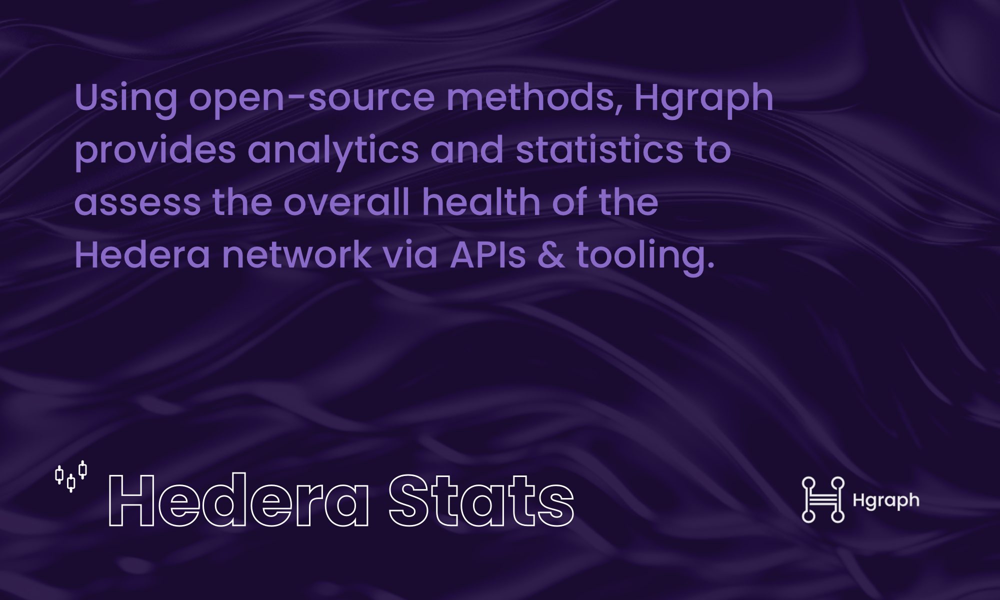

# About Hedera Stats

Hgraph offers API access to various quantitative statistical measurements for the Hedera network based on open-sourced methodologies outlined in this documentation. These statistics leverage Hedera mirror node data, data computation, 3rd party data sources and Hgraph's GraphQL API and can be used for analysis in various metrics and KPIs. If you're looking to access the "Hedera Stats" via Hgraph's APIs, you can [get started here](https://hgraph.com/hedera). If you're looking to contribute to the "Hedera Stats" project on GitHub, [check out the repository](https://github.com/hgraph-io/hedera-stats).

**Quick links:**

- [Installation](installation)
- [GitHub repository](https://github.com/hgraph-io/hedera-stats)
- [Demo dashboard](https://hgraph.com/hedera/stats)

:::info New Hedera Stats Dashboard
See these Hedera Stats in action using **[Hgraph's new Grafana dashboard](https://hgraph.com/hedera/stats)** demo! A dynamic layout, customizations, visualizations and more.
:::

## Hedera Stats Demo Walkthrough Video

Brandon Davenport, Director of Communications at Hgraph, gives a detailed walkthrough of the Hedera Stats demo Grafana dashboard, explains the documentation and methodology, and answers frequently asked questions.

<iframe
  width="100%"
  height="315"
  src="https://www.youtube.com/embed/8yWw7wZ0H64"
  title="Hedera Stats Demo Grafana Dashboard Walkthrough"
  frameborder="0"
  allow="accelerometer; autoplay; clipboard-write; encrypted-media; gyroscope; picture-in-picture"
  allowfullscreen></iframe>

## Why create Hedera Stats?

Understanding the health of the Hedera network is important. To measure this, we use things like TVL, revenue, active accounts, time to consensus and more. What's most important is ensuring the methodology used for these calculations are transparent and comprehensive to maintain consistency. It's also vital to ensure easy access to these data feeds via APIs. Hgraph's data infrastructure makes this possible.

## Statistics Methodologies

Hgraph provides access to various Hedera network statistics via the GraphQL API. These statistics offer insights into network activity, token usage, NFT transactions, and economic factors within the Hedera ecosystem. Below is a categorized list of supported statistics, along with descriptions.

:::note Hedera Data Access
To access this Hedera network statistic ([and others](/category/hedera-stats/)) via Hgraph's GraphQL & REST APIs, **[get started here](https://www.hgraph.com/hedera)**.
:::

## Mainnet Hedera Stats

A breakdown of all available Hedera Stats on mainnet. Each link will take you to the methodology and the code snippit is the `name` of the stat in the `ecosystem_metric` table (utilized in GraphQL queries).

### HBAR & DeFi

- [HBAR Price](/hedera-stats/hbar-defi/hbar-price): `avg_usd_conversion`
- [Total Value Locked](/hedera-stats/hbar-defi/total-value-locked): `network_tvl`
- [Stablecoin Market Cap](/hedera-stats/hbar-defi/stablecoin-market-cap): `stablecoin_marketcap`

### Network Performance

- [Network Fees](/hedera-stats/network-performance/revenue): `network_fees`
- [Time to consensus](/hedera-stats/network-performance/time-to-consensus): `avg_time_to_consensus`
- [Transactions Per Second](/hedera-stats/network-performance/transactions-per-second): `network_tps`

### Activity & Engagement

- Active Accounts:
  - [All Accounts](/hedera-stats/activity-engagement/active-accounts): `active_accounts`
  - [Developer Accounts](/hedera-stats/activity-engagement/active-developer-accounts): `active_developer_accounts`
  - [Retail Accounts](/hedera-stats/activity-engagement/active-retail-accounts): `active_retail_accounts`
  - [ECDSA Accounts](/hedera-stats/activity-engagement/active-ecdsa-accounts): `active_ecdsa_accounts`
  - [Ed25519 Accounts](/hedera-stats/activity-engagement/active-ed25519-accounts): `active_ed25519_accounts`
- New Accounts:
  - [All Accounts](/hedera-stats/activity-engagement/new-accounts): `new_accounts`
  - [ECDSA Accounts](/hedera-stats/activity-engagement/new-ecdsa-accounts): `new_ecdsa_accounts`
  - [Ed25519 Accounts](/hedera-stats/activity-engagement/new-ed25519-accounts): `new_ed25519_accounts`
- Total Accounts:
  - [All Accounts](/hedera-stats/activity-engagement/total-accounts): `total_accounts`
  - [ECDSA Accounts](/hedera-stats/activity-engagement/total-ecdsa-accounts): `total_ecdsa_accounts`
  - [Ed25519 Accounts](/hedera-stats/activity-engagement/total-ed25519-accounts): `total_ed25519_accounts`

### EVM

- [Active Smart Contracts](/hedera-stats/evm/active-smart-contracts)
- [New Smart Contracts](/hedera-stats/evm/new-smart-contracts)
- [Total Smart Contracts](/hedera-stats/evm/total-smart-contracts)

### NFTs

- [NFT Collection Sales Volume](/hedera-stats/non-fungible-tokens/nft-collection-sales-volume)
- [NFT Collection Sales Volume (Total)](/hedera-stats/non-fungible-tokens/nft-collection-sales-volume-total)

> *See these statistics in action on the [Hgraph Hedera Stats demo Grafana dashboard](https://hgraph.com/hedera/stats).*

### Roadmap

- More aggrigate breakdowns for accounts
- New EVM specific statistics
- More computed periods (`hour` and `day`)
- Top 50 contracts, NFTs and fungible tokens
- Additional HBAR related statistics
- More 3rd party data sources
- Granular transaction breakdowns
- More examples and demos

---

## Hedera Stats Users

Leading organizations, projects and ecosystems trust Hedera Stats data streams. Some of these include [Hedera](https://hedera.com) (website), [HashScan](https://hashscan.io), [Hashgraph](https://www.hashgraph.com), [Hashpoint Research](https://www.hashpoint.io), [The Hashgraph Group](https://www.hashgraph-group.com) and more. Tell us about [your project](https://forms.gle/DGS8cPMWxcRc6jCM8).

## GitHub Repository

This repository contains the SQL code for these Hedera Stats queries as well as JSON to import a demo Grafana dashboard. It also has information regarding incremental update setup.

**[View Hedera Stats on GitHub →](https://github.com/hgraph-io/hedera-stats)**

## Additional Resources

- [Hgraph's Hedera Stats Dashboard](https://hgraph.com/hedera/stats)
- [Hedera Mirror Node Docs](https://docs.hedera.com/hedera/core-concepts/mirror-nodes)
- [Hedera Transaction Result Codes](https://github.com/hashgraph/hedera-mirror-node/blob/main/hedera-mirror-rest/model/transactionResult.js)
- [Hedera Transaction Types](https://github.com/hashgraph/hedera-mirror-node/blob/main/hedera-mirror-rest/model/transactionType.js)
- [DeFiLlama API Documentation](https://defillama.com/docs/api)
- [PostgreSQL Documentation](https://www.postgresql.org/docs/current/)

## Key Terms

- **Statistic:** Describes or summarizes data, often for analysis.
- **Metric:** Measures progress or performance against a defined objective.
- **KPI:** A measurable value that tracks progress toward a specific goal, indicating how effectively something is performing.
- **Quantitative measurement:** Focuses on numerical, measurable, and objective data. It answers questions like how much, how many, how often, or to what extent.
- **Composite Statistic:** A summarization of data aggrigated from other pre-calculated data.

## Get Involved

This open-source **Hedera Stats** project is developed and maintained by [Hgraph](https://hgraph.com). Have questions or feedback? [Contact us](/overview/contact). Want to contribute? Check out the [GitHub repository](https://github.com/hgraph-io/hedera-stats).

:::info New Hedera Stats Dashboard
See these Hedera Stats in action using **[Hgraph's new Grafana dashboard](https://hgraph.com/hedera/stats)** demo! A dynamic layout, customizations, visualizations and more.
:::