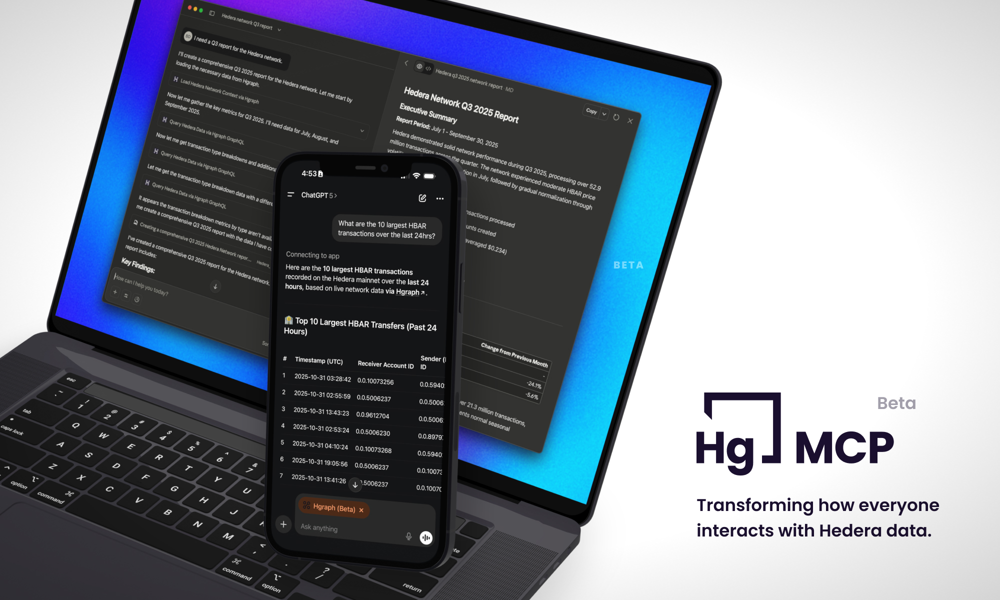

## Connect AI to Hedera Blockchain Data

The Hgraph MCP Server connects AI assistants like Claude and ChatGPT directly to [Hedera](https://hedera.com) blockchain data. Query the network using natural language—no coding required. AI assistants have general blockchain knowledge but cannot access live, network-specific data on their own—they need a real-time connection to Hedera's network, which is what this MCP connector provides.

Built by [Hgraph](https://hgraph.com), we provide enriched data from bare metal Hedera mirror nodes with real-time updates, DeFi metrics, and comprehensive network analytics.

**What you can do:**

- ❌ **Before**: "Give me a portfolio breakdown of my Hedera account" → "I don't have access to current network data"
- ✅ **After**: "Give me a portfolio breakdown of my Hedera account" → *Real-time answer with current metrics, activity and holdings*

Ask questions in plain English, get live blockchain data—no APIs, no manual queries, no complexity.

## Quick Start {#quick-start}

**Choose your platform:**

  

    

      

        <h3>Claude Setup</h3>
      

      

        
Recommended - Native MCP support

      

      

        <a href="/mcp-server/setup-claude" className="button button--primary button--block">Set Up Claude →</a>
      

    

  

  

    

      

        <h3>ChatGPT Setup</h3>
      

      

        
Developer Mode required (beta)

      

      

        <a href="/mcp-server/setup-chatgpt" className="button button--secondary button--block">Set Up ChatGPT →</a>
      

    

  

**Not sure which?** See [platform comparison](#platforms) below.

## What You'll Need (Two Things)

### 1. Paid Subscription to Claude or ChatGPT

Pick one of these paid plans:

- **Claude Pro** ($20/month) - [Subscribe →](https://claude.ai)
- **OR ChatGPT Plus** ($20/month) - [Subscribe →](https://chat.openai.com)

:::warning Paid Subscription Required
The free versions of Claude and ChatGPT cannot connect to external MCP servers. You need a paid subscription.
:::

### 2. Free Hgraph Account

Create a free Hgraph account to get your API key:

- [Sign up at hgraph.com →](https://hgraph.com/hedera)
- No credit card required
- Takes 2 minutes

:::tip Two Separate Accounts
You'll have two accounts: your paid Claude/ChatGPT account + your free Hgraph account. These are separate and you don't need any other API keys.
:::

**That's it!** One paid subscription + one free Hgraph account = you're ready to go!

## Platform Comparison {#platforms}

**Claude (Recommended)**: Native MCP support, works across web/desktop/mobile, easiest setup.

**ChatGPT**: Requires Developer Mode (beta feature), web and mobile supported, slightly more setup steps.

**More platforms coming**: We're working on support for additional AI platforms and custom solutions. [Join our Discord](https://discord.gg/dwxpRHHVWX) for updates.

## Learn More

- **[Examples & Use Cases →](/mcp-server/examples)** - See what's possible
- **[Usage Tips & Best Practices →](/mcp-server/usage-guide)** - Get the most from your MCP

---

*The Hgraph MCP Server is currently in beta. We're actively improving it based on user feedback. Your experience and suggestions help shape the future of blockchain data access.*
