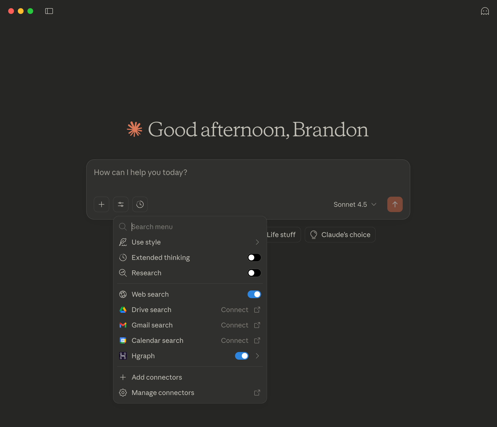
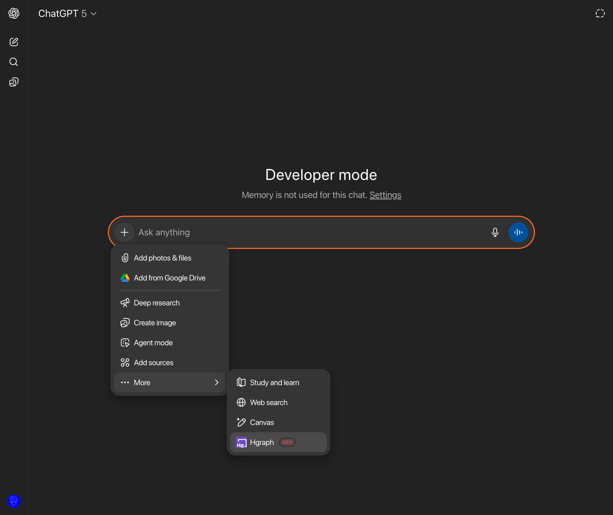
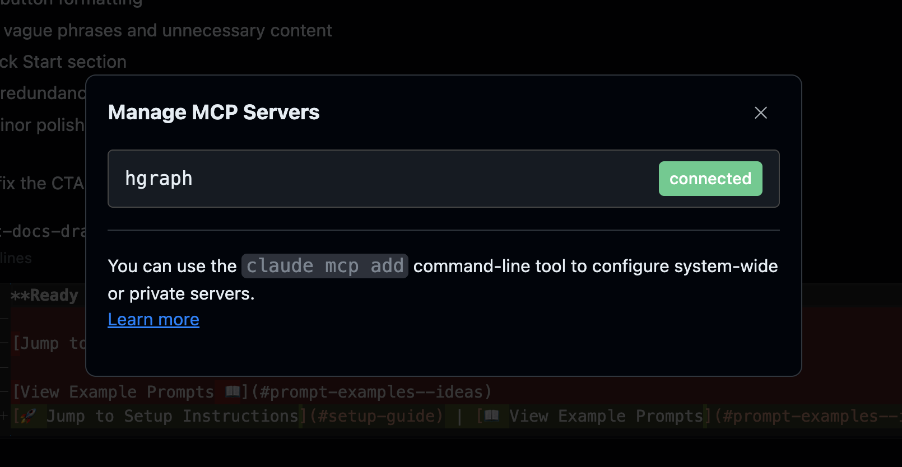

## Unlock Hedera Blockchain Data in Your AI Assistant

The Hgraph MCP Server is a powerful bridge that connects AI assistants like Claude and ChatGPT directly to [Hedera](https://hedera.com) network data. Built by [Hgraph](https://hgraph.com), a company focused on accelerating blockchain data access, this Model Context Protocol (MCP) server enables natural language queries to instantly retrieve on-chain information from Hedera—one of the fastest, most decentralized networks with a rapidly growing DeFi ecosystem.

Hgraph operates bare metal Hedera mirror nodes for lightning-fast data access, serving all mirror node data back to genesis with real-time updates. We provide enriched data through [Hedera Stats](https://docs.hgraph.com/hedera-stats) for comprehensive network analytics and KPIs, plus our [ERC Token Indexer](https://docs.hgraph.com/erc-token-data/overview) for real-time ERC-20 and ERC-721 token data. This means your AI assistant has access to the most reliable and comprehensive Hedera data available.

Whether you're an analyst generating reports, a developer building complex queries, or a Hedera enthusiast exploring the ecosystem, the Hgraph MCP Server transforms how you interact with blockchain data—no coding required, just conversation.

---

## Supported Platforms

### Where You Can Use Hgraph MCP

**Claude Family (Recommended)**
- **Claude Web & Desktop** - Native MCP support with seamless integration
- **Claude Code CLI** - Developer-focused with advanced features
- **Claude Mobile** - Auto-syncs from web/desktop configuration
- Requires Claude Pro subscription for custom connectors

**ChatGPT Family**
- **ChatGPT Web** - Supported via Developer Mode
- **ChatGPT Mobile** - Auto-syncs from web configuration
- Requires ChatGPT Plus subscription and Developer Mode enabled
- MCP not supported in Deep Research mode

**Key Points:**
- Mobile apps inherit configurations—set up once on web/desktop, use everywhere
- We recommend Claude for the best experience with native MCP support
- Additional LLM platform support coming soon

**Ready to connect your AI to Hgraph MCP?**
[🚀 Jump to Setup Instructions](#setup-guide) | [📖 View Example Prompts](#prompt-examples--ideas)

---

## What is MCP?

The Model Context Protocol (MCP) is an open standard created by Anthropic and announced in November 2024. MCP standardizes how AI assistants connect to external data sources and tools, replacing fragmented integrations with a universal protocol. [Learn more about MCP →](https://modelcontextprotocol.io/docs/getting-started/intro)

Think of MCP as a universal translator between AI and data. Before MCP, each AI platform needed custom integrations for every data source. Now, any MCP-compliant server works with any MCP-enabled AI assistant, creating an ecosystem of interoperable tools.

Hgraph chose to implement MCP because it aligns perfectly with our mission: making blockchain data accessible to everyone. By building on this open standard, we ensure the Hgraph MCP Server will work with current and future AI platforms, providing long-term value to the Hedera community.

---

## Prompt Examples & Ideas

### Analyst: Monthly Reporting in Claude Desktop
**Prompt:** "Generate a monthly report showing key Hedera network metrics. Provide this as a document/artifact."

*The MCP server will query multiple data sources, aggregate metrics, and return formatted results ready for your reports.*

### Developer: Token Discovery in Claude Code
**Prompt:** "Get the 5 latest ERC-20 tokens on Hedera with a metadata reliability score of 0.75 or greater"

*Perfect for exploring new tokens, analyzing deployment patterns, and filtering by quality metrics with precise queries.*

### Hedera Enthusiast: Portfolio Analysis on ChatGPT Mobile
**Prompt:** "Please give me a portfolio breakdown of fungible and non-fungible tokens for account 0.0.XYZ and recent transfer activity."

*Check your portfolio, track NFT collections, and monitor account activity from anywhere.*

### More Ideas to Explore
Discover token analytics and holder distributions, analyze NFT collection metrics and transfer patterns, monitor transaction volumes and fee trends, investigate smart contract calls and gas usage, track DeFi metrics and liquidity pools, explore HCS topic message activity, or identify unusual network patterns and behaviors.

---

## Setup Guide

*Note: The Hgraph MCP Server is currently in beta. We're actively improving it based on user feedback. Your experience and suggestions help shape the future of blockchain data access.*

### Prerequisites

Before setting up the MCP connector, you'll need:

1. **Hgraph API Key** (Free)
   - Create an account at [hgraph.com/hedera](https://hgraph.com/hedera)
   - Get your free API key from the dashboard
   - No credit card required for the free tier

2. **AI Platform Account**
   - Claude: Pro subscription required for custom connectors
   - ChatGPT: Plus subscription required for Developer Mode

### Official Hgraph MCP URL

Use this URL format with your API key:

```text
https://mainnet.hedera.api.hgraph.io/v1/<YOUR-HGRAPH-API-KEY>/mcp
```

Replace `<YOUR-HGRAPH-API-KEY>` with your actual API key from the [Hgraph dashboard](https://dashboard.hgraph.com).

### Set up in Claude Web, Desktop & Mobile (Recommended)

Claude offers the smoothest MCP experience with native support and flexible configuration.



1. Sign in to [Claude web](https://claude.ai) or open Claude Desktop
2. Click your profile icon (bottom left) and select "Settings"
3. Navigate to the "Connectors" tab in the left sidebar
4. Click "Add custom connector" button
5. In the "Name" field, enter `Hgraph` (case-sensitive)
6. In the "URL" field, paste your complete MCP URL with your API key:

   ```text
   https://mainnet.hedera.api.hgraph.io/v1/<YOUR-HGRAPH-API-KEY>/mcp
   ```
7. Click "Save connector" and you'll see Hgraph in your connectors list

#### How to use Hgraph MCP in Claude

1. Start a new chat and ensure the Hgraph connector is switched "on"
2. Write prompts that specify Hedera data queries (see examples above)
3. Claude automatically calls the appropriate Hgraph tools

*Reminder: Once configured in Claude web or desktop, the Hgraph MCP will automatically appear in the Claude mobile app when signed into the same account.*

### Set up in ChatGPT Web & Mobile

ChatGPT requires [Developer Mode](https://platform.openai.com/docs/guides/developer-mode) for MCP support. This is a beta feature that provides powerful integration capabilities.



1. Sign in to [ChatGPT web](https://chat.openai.com)
2. Click your profile icon (bottom left) → "Settings"
3. Navigate to the "Apps & Connectors" tab
4. Scroll down to find "Advanced Settings" section
5. Toggle "Developer Mode" to ON (you'll see a warning - click "Enable")
6. Navigate back to the "Apps & Connectors" tab (refresh if needed)
7. Click the "Create" button at the top right
8. Configure your connector:
   - **Name**: Enter `Hgraph`
   - **MCP URL**: Paste your complete URL with API key:

     ```text
     https://mainnet.hedera.api.hgraph.io/v1/<YOUR-HGRAPH-API-KEY>/mcp
     ```
   - **Authentication**: Select "No Authentication" (API key is in the URL)
9. Check the confirmation box and click "Create"
10. You should see "Hgraph" appear in your connectors list

*Troubleshooting: If the connector doesn't appear, refresh the page and ensure Developer Mode is still enabled.*

#### How to use Hgraph MCP in ChatGPT

1. Ensure Developer Mode is active in settings
2. Start a new chat and click the + button
3. In the dropdown, navigate to: More > Hgraph (connector appears in prompt box)
4. Write prompts that specify Hedera data queries (see examples above)
5. ChatGPT automatically calls the appropriate Hgraph tools

*Note: MCP servers do not work in ChatGPT's Deep Research mode. MCP servers do not currently work in ChatGPT Desktop.*

*Reminder: Once configured in ChatGPT web, the Hgraph MCP will work on the ChatGPT mobile app when signed into the same account.*

### Set Up in Claude Code CLI

Claude Code provides the most powerful MCP experience for developers and technical users.



1. Install Claude Code ([installation guide](https://docs.claude.com/en/docs/claude-code/getting-started))
2. Complete any IDE-specific configurations
3. Add the Hgraph MCP connector via terminal:
   ```bash
   claude mcp add --transport http hgraph https://mainnet.hedera.api.hgraph.io/v1/<YOUR-HGRAPH-API-KEY>/mcp
   ```
4. Restart Claude Code:
   - VS Code: Reload window (Cmd/Ctrl+R)
   - Terminal: Exit and restart your session
5. Verify the connection:
   ```bash
   claude mcp list
   ```
   You should see `hgraph` in the list of connected MCPs

#### How to use Hgraph MCP in Claude Code CLI

Simply start a conversation and write prompts that specify Hedera data queries. Claude Code automatically calls the appropriate Hgraph tools.

*Tip: To avoid approving every Hgraph tool call, configure auto-approval by adding to your allowlist:*
```bash
# Add Hgraph tools to auto-approval list
claude config set allowlist "mcp__hgraph__*"
```

### Set up in Other LLM Apps

The Hgraph MCP Server is fully MCP-compliant and may work with other AI applications and CLIs that support the protocol. While we haven't tested every platform, we encourage experimentation and welcome feedback on your experiences. Custom applications can also integrate the MCP server, though results may vary depending on implementation.

### Quick Start - Try Your First Query

Once your MCP connector is configured, test the connection with this simple query:

**"What is the current total supply of HBAR?"**

If successful, you'll see Hedera network data returned directly in your chat. Now you can explore more complex queries from our examples above!

---

## Usage Tips & Ideas

- **Be specific with your queries**: Use entity IDs (like 0.0.XYZ for accounts), time ranges, and clear metrics for best results. The more specific your prompt, the more accurate the data.

- **Explore the underlying queries**: Ask the AI to show you the GraphQL or SQL queries it's using. This transparency helps you understand the data and learn query patterns.

- **Combine with AI capabilities**: Request charts, dashboards, CSV exports, or markdown tables. The AI can transform raw blockchain data into any format you need.

- **Start with context**: The MCP automatically loads essential schemas, but you can ask for additional examples or explore specific data types for deeper insights.

- **Follow prompting best practices**: For optimal results, refer to [Claude's prompting guide](https://docs.anthropic.com/en/docs/build-with-claude/prompt-engineering/overview) or [OpenAI's prompt engineering strategies](https://platform.openai.com/docs/guides/prompt-engineering).

---

## Verifying Information

Since LLMs can occasionally generate inaccurate information (known as "hallucination"), we recommend verifying critical data during this beta phase. Cross-reference important information with the [Hgraph Dashboard](https://dashboard.hgraph.com), where you can run the same queries generated by your AI assistant for confirmation. This extra verification step ensures accuracy for important decisions while we continue to refine and improve the service.

---

## Safety

The Hgraph MCP Server prioritizes security and safety through multiple layers of protection:

**Read-Only Operations**: The server cannot write data to the Hedera network, sign transactions, or modify any blockchain state. All operations are strictly read-only queries.

**Robust Security Features**:
- Input validation on all queries using strict schemas
- Rate limiting to prevent abuse
- Query timeouts for resource protection
- SQL injection prevention through prepared statements
- Automatic redaction of sensitive data in logs
- Allowlisted RPC methods only

**Data Protection**: We never request or handle private keys, seed phrases, or authentication credentials beyond your API key. The MCP server only accesses publicly available blockchain data.

---

## Feedback

We value your feedback as we continue to improve the Hgraph MCP Server during beta:

- **Discord Community**: Join our discussions at [discord.gg/dwxpRHHVWX](https://discord.gg/dwxpRHHVWX)
- **Support Documentation**: Visit [docs.hgraph.com/support](https://docs.hgraph.com/support)
- **Email Support**: Reach out to [support@hgraph.com](mailto:support@hgraph.com)

When reporting issues, please include:
- Your original prompt
- The error message or unexpected behavior
- Which AI platform you're using (Claude, ChatGPT, etc.)
- Any relevant context about what you were trying to achieve

Your feedback helps us build better tools for the entire Hedera ecosystem.
