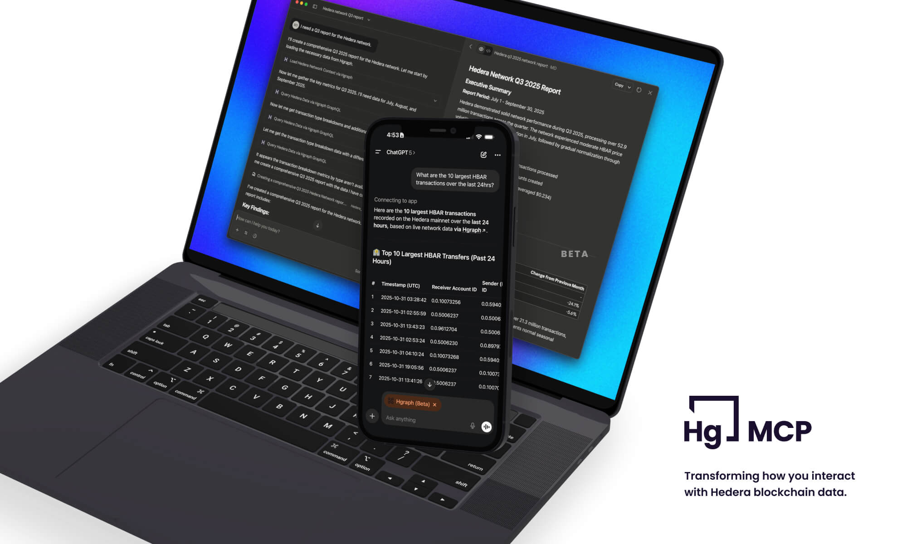

## Unlock Hedera Blockchain Data in Your AI Assistant

The Hgraph MCP Server is a powerful bridge that connects AI assistants like Claude and ChatGPT directly to [Hedera](https://hedera.com) network data. Built by [Hgraph](https://hgraph.com), a company focused on accelerating blockchain data access, this Model Context Protocol (MCP) server enables natural language queries to instantly retrieve on-chain information from Hedera—one of the fastest, most decentralized networks with a rapidly growing DeFi ecosystem.

Hgraph operates bare metal Hedera mirror nodes for lightning-fast data access, serving all mirror node data back to genesis with real-time updates. We provide enriched data through [Hedera Stats](https://docs.hgraph.com/hedera-stats) for comprehensive network analytics and KPIs, plus our [ERC Token Indexer](https://docs.hgraph.com/erc-token-data/overview) for real-time ERC-20 and ERC-721 token data. This means your AI assistant has access to the most reliable and comprehensive Hedera data available.

Whether you're an analyst generating reports, a developer building complex queries, or a Hedera enthusiast exploring the ecosystem, the Hgraph MCP Server transforms how you interact with blockchain data—no coding required, just conversation.

## Supported Platforms

### Where You Can Use Hgraph MCP

**Claude Family (Recommended)**
- **Claude Web & Desktop** - Native MCP support with seamless integration
- **Claude Code CLI** - Developer-focused with advanced features
- **Claude Mobile** - Auto-syncs from web/desktop configuration
- Requires Claude Pro subscription for custom connectors

**ChatGPT Family**
- **ChatGPT Web** - Supported via Developer Mode
- **ChatGPT Mobile** - Auto-syncs from web configuration
- Requires ChatGPT Plus subscription and Developer Mode enabled
- MCP not supported in Deep Research mode

**Key Points:**
- Mobile apps inherit configurations—set up once on web/desktop, use everywhere
- We recommend Claude for the best experience with native MCP support
- Additional LLM platform support coming soon

## What is MCP?

The Model Context Protocol (MCP) is an open standard created by Anthropic and announced in November 2024. MCP standardizes how AI assistants connect to external data sources and tools, replacing fragmented integrations with a universal protocol. [Learn more about MCP →](https://modelcontextprotocol.io/docs/getting-started/intro)

Think of MCP as a universal translator between AI and data. Before MCP, each AI platform needed custom integrations for every data source. Now, any MCP-compliant server works with any MCP-enabled AI assistant, creating an ecosystem of interoperable tools.

Hgraph chose to implement MCP because it aligns perfectly with our mission: making blockchain data accessible to everyone. By building on this open standard, we ensure the Hgraph MCP Server will work with current and future AI platforms, providing long-term value to the Hedera community.

## Quick Navigation

  

    

      

        <h3>🚀 Setup Guides</h3>
      

      

        
Platform-specific installation instructions

      

      

        <a href="./setup-claude" className="button button--primary button--block">Claude Setup</a>
        <a href="./setup-chatgpt" className="button button--secondary button--block margin-top--sm">ChatGPT Setup</a>
      

    

  

  

    

      

        <h3>📖 Learn & Explore</h3>
      

      

        
Examples, tips, and best practices

      

      

        <a href="./examples" className="button button--primary button--block">View Examples</a>
        <a href="./usage-guide" className="button button--secondary button--block margin-top--sm">Usage Guide</a>
      

    

  

## Get Started

Choose your platform to begin:

- **[Claude Setup Guide →](./setup-claude)** - Recommended for best experience
- **[ChatGPT Setup Guide →](./setup-chatgpt)** - Requires Developer Mode
- **[Examples & Use Cases →](./examples)** - See what's possible
- **[Usage Tips & Best Practices →](./usage-guide)** - Get the most from your MCP

---

*The Hgraph MCP Server is currently in beta. We're actively improving it based on user feedback. Your experience and suggestions help shape the future of blockchain data access.*
