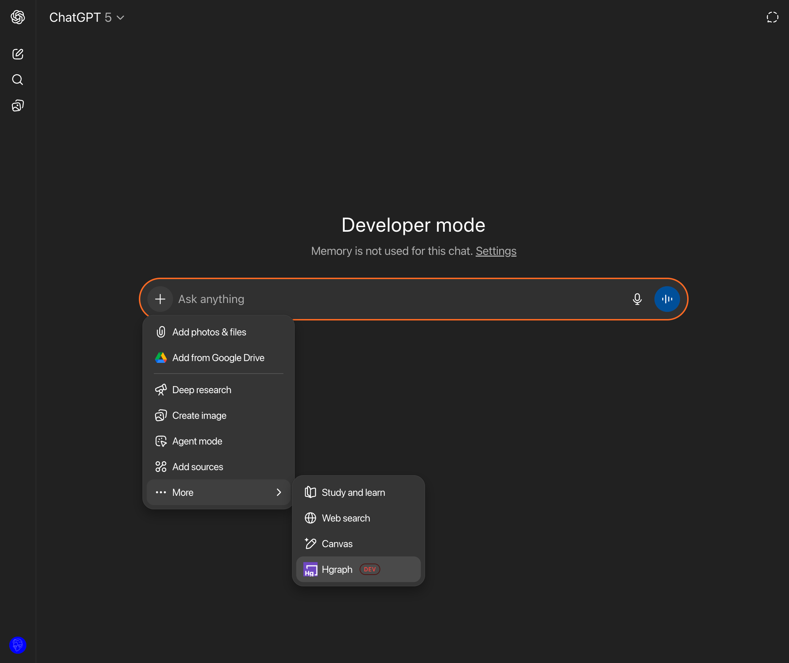

:::caution Service Maintenance
We are currently performing backend maintenance to enhance the MCP Server experience. Some features may be temporarily unavailable. We apologize for any inconvenience and appreciate your patience. Please check back soon for updates.
:::

# ChatGPT Setup Guide

ChatGPT supports MCP through its [Developer Mode](https://platform.openai.com/docs/guides/developer-mode) feature, enabling integration with external data sources like the Hgraph MCP Server. While this beta feature requires additional setup steps, it provides full access to Hedera blockchain data through natural language queries.

## Prerequisites

Before setting up the MCP connector, you'll need:

1. **Hgraph API Key** (Free)
   - Create an account at [hgraph.com/hedera](https://hgraph.com/hedera)
   - Get your free API key from the dashboard
   - No credit card required for the free tier

2. **ChatGPT Account**
   - ChatGPT Plus subscription required for Developer Mode
   - Available at [chat.openai.com](https://chat.openai.com)

## Official Hgraph MCP URL

Use this URL format with your API key:

```text
https://mainnet.hedera.api.hgraph.io/v1/<YOUR-HGRAPH-API-KEY>/mcp
```

Replace `<YOUR-HGRAPH-API-KEY>` with your actual API key from the [Hgraph dashboard](https://dashboard.hgraph.com).

## Set up in ChatGPT Web



### Enable Developer Mode

1. Sign in to [ChatGPT web](https://chat.openai.com)
2. Click your profile icon (bottom left) → "Settings"
3. Navigate to the "Apps & Connectors" tab
4. Scroll down to find "Advanced Settings" section
5. Toggle "Developer Mode" to ON (you'll see a warning - click "Enable")

### Add Hgraph Connector

6. Navigate back to the "Apps & Connectors" tab (refresh if needed)
7. Click the "Create" button at the top right
8. Configure your connector:
   - **Name**: Enter `Hgraph`
   - **MCP URL**: Paste your complete URL with API key:

     ```text
     https://mainnet.hedera.api.hgraph.io/v1/<YOUR-HGRAPH-API-KEY>/mcp
     ```

   - **Authentication**: Select "No Authentication" (API key is in the URL)

9. Check the confirmation box and click "Create"
10. You should see "Hgraph" appear in your connectors list

:::caution Troubleshooting
If the connector doesn't appear, refresh the page and ensure Developer Mode is still enabled.
:::

## How to use Hgraph MCP in ChatGPT

1. Ensure Developer Mode is active in settings
2. Start a new chat and click the + button
3. In the dropdown, navigate to: **More → Hgraph** (connector appears in prompt box)
4. Write prompts that specify Hedera data queries
5. ChatGPT automatically calls the appropriate Hgraph tools

**Example prompt:** "What's the current HBAR price and market cap?"

## Important Notes

:::warning Platform Limitations
- MCP servers do **not** work in ChatGPT's Deep Research mode
- MCP servers do **not** currently work in ChatGPT Desktop app
- Only web version fully supports MCP at this time
- For native MCP support, consider using [Claude](/mcp-server/setup-claude) instead
:::

:::tip Mobile Support
Once configured in ChatGPT web, the Hgraph MCP will work on the ChatGPT mobile app when signed into the same account.
:::

## Troubleshooting

### Developer Mode not available
- Ensure you have an active ChatGPT Plus subscription
- Try logging out and back in
- Clear browser cache if issues persist

### Connector creation fails
- Double-check the MCP URL format
- Ensure your API key is valid and active
- Make sure "No Authentication" is selected

### Connector not appearing in chat
- Refresh the chat page
- Verify Developer Mode is still enabled
- Try creating a new chat session

### Error messages during use
- Check that your Hgraph API key hasn't expired
- Ensure you're not in Deep Research mode
- Try disconnecting and reconnecting the connector

## Security Considerations

- Your API key is included in the URL for authentication
- ChatGPT cannot modify or write data - all operations are read-only
- The MCP server only accesses publicly available blockchain data

## Next Steps

- [View Examples & Use Cases →](/mcp-server/examples)
- [Learn Usage Tips & Best Practices →](/mcp-server/usage-guide)
- [Claude Setup Guide →](/mcp-server/setup-claude)

---

*Need help? Visit [our support page](/support) or join our [Discord community](https://discord.gg/dwxpRHHVWX)*
