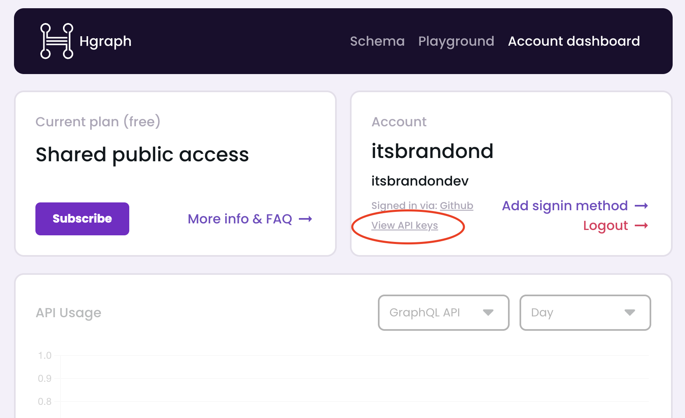
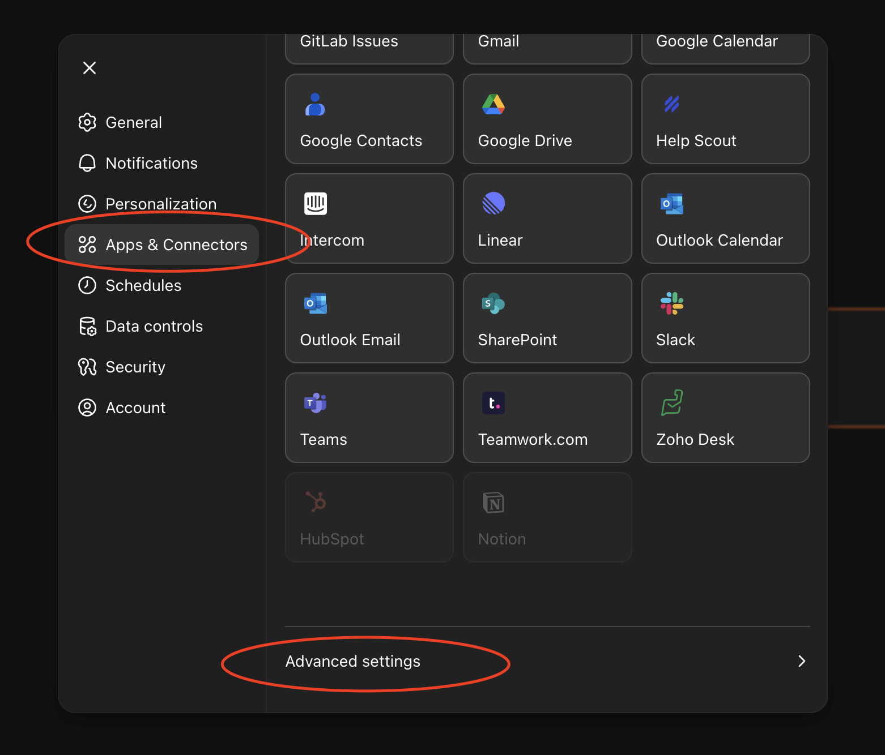
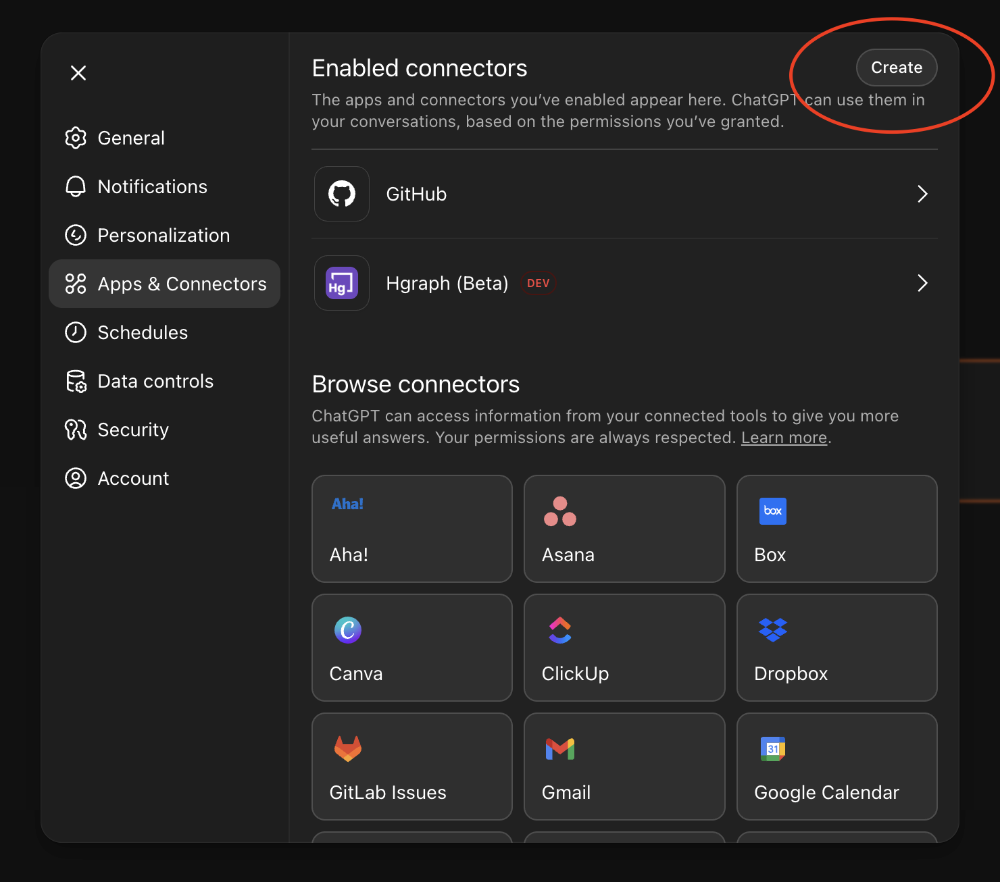
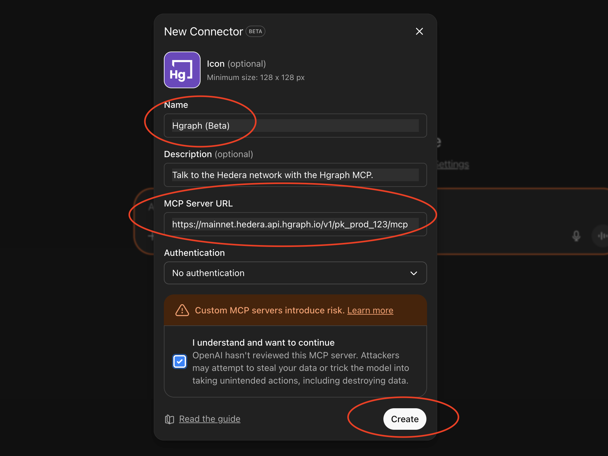
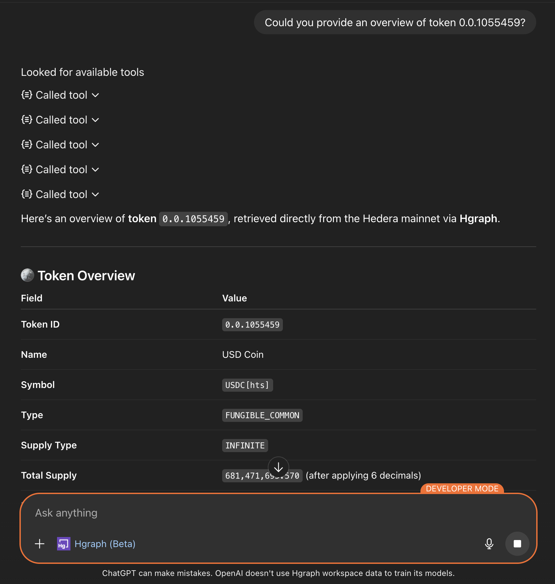

# ChatGPT Setup Guide

ChatGPT supports MCP through its [Developer Mode](https://platform.openai.com/docs/guides/developer-mode) feature, enabling integration with external data sources like the Hgraph MCP Server. While this beta feature requires additional setup steps, it provides full access to Hedera blockchain data through natural language queries.

**Hgraph MCP URL**

```text
https://mainnet.hedera.api.hgraph.io/v1/YOUR_PUBLISHABLE_KEY/mcp
```

## Video Tutorial

<iframe
  width="100%"
  style={{"aspect-ratio": "16 / 9"}}
  src="https://www.youtube.com/embed/NUbwr05lA2E"
  title="ChatGPT Hgraph MCP Setup Tutorial"
  frameBorder="0"
  allow="accelerometer; autoplay; clipboard-write; encrypted-media; gyroscope; picture-in-picture; web-share"
  referrerPolicy="strict-origin-when-cross-origin"
  allowFullScreen>
</iframe>


## Prerequisites

Before setting up the MCP connector, you'll need:

1. **Hgraph Publishable API Key** (Free)
   - Create an account at [hgraph.com/hedera](https://hgraph.com/hedera)
   - Get your free **Publishable API Key** from the [Hgraph dashboard](https://dashboard.hgraph.com)
   - Your Publishable Key starts with `pk_prod_` (e.g., `pk_prod_abc123xyz...`)
   - No credit card required for the free tier

2. **ChatGPT Account**
   - ChatGPT Plus subscription required for Developer Mode
   - Available at [chat.openai.com](https://chat.openai.com)

---

## Set up in ChatGPT Web

Follow these 5 steps to connect Hgraph to ChatGPT:

### Step 1: Get Your Hgraph Publishable API Key

Sign in to the [Hgraph dashboard](https://dashboard.hgraph.com), navigate to the API Keys section, and copy your Publishable API Key (starts with `pk_prod_`).

<details>
<summary>**Show me where to find my Publishable API Key**</summary>

Navigate to the API Keys section in your Hgraph dashboard and look for your Publishable Key (starts with `pk_prod_`).



</details>

### Step 2: Enable Developer Mode

In ChatGPT, navigate to Settings → Apps & Connectors → Advanced Settings and toggle Developer Mode ON.

<details>
<summary>**Show me how to enable Developer Mode**</summary>

**Opening Settings:**

1. Sign in to [ChatGPT web](https://chat.openai.com)
2. Click your profile icon or menu (typically in the bottom left)
3. Select "Settings" from the menu

**Navigating to Developer Mode:**

4. In Settings, click "Apps & Connectors" in the left sidebar
5. Scroll down to the "Advanced Settings" section at the bottom
6. Find the "Developer Mode" toggle
7. Toggle it ON (you'll see a warning about beta features)
8. Click "Enable" to confirm



Developer Mode is now enabled! You can now create custom MCP connectors.

:::info Developer Mode Requirement
Developer Mode is a beta feature required to add custom MCP connectors. It's available for ChatGPT Plus, Business, Enterprise, and Education accounts.
:::

</details>

### Step 3: Navigate to Create Connector

Go to Settings → Apps & Connectors → Create to add a new connector.

<details>
<summary>**Show me where to find the Create button**</summary>

**Finding Create Connector:**

1. Make sure you're still in Settings
2. Click "Apps & Connectors" in the left sidebar (if you navigated away)
3. Near the top of the page, you'll see a "Create" button
4. Click "Create" to open the connector creation form



The connector creation dialog will open.

</details>

### Step 4: Configure Hgraph Connector

Fill out the connector form with these exact details:
- **Name:** `Hgraph`
- **MCP URL:** `https://mainnet.hedera.api.hgraph.io/v1/YOUR_PUBLISHABLE_KEY/mcp`
- **Authentication:** Select "No Authentication"
  - Your Publishable Key in the URL provides secure authentication
  - This is the correct setting for Hgraph MCP

<details>
<summary>**Show me step-by-step with screenshots**</summary>

**Filling out the form:**

1. In the "Name" field, type exactly: `Hgraph`

2. In the "MCP URL" field, paste: `https://mainnet.hedera.api.hgraph.io/v1/YOUR_PUBLISHABLE_KEY/mcp`
   - Replace `YOUR_PUBLISHABLE_KEY` with your actual Publishable API Key (starts with `pk_prod_`)

3. In the "Authentication" dropdown, select "No Authentication"
   - The Publishable Key in the URL is sufficient for authentication

**Example URL:**
```text
https://mainnet.hedera.api.hgraph.io/v1/pk_prod_abc123xyz789/mcp
```



**Creating the connector:**

4. Check the confirmation box (if required)
5. Click "Create" to save the connector

Success! You should now see "Hgraph" in your connectors list.

</details>

### Step 5: Test Your Setup

Start a new chat, enable the Hgraph connector, and try this test query:

**"Could you provide an overview of token 0.0.1055459?"**

<details>
<summary>**Show me what success looks like**</summary>

When your MCP is working correctly, you'll see:

1. ChatGPT will indicate it's using the Hgraph connector/tools
2. You'll receive real Hedera token data in the response
3. The response will include specific details about the token (name, symbol, supply, etc.)



**Success indicator:** You see real, current Hedera token data with specific numbers and details.

**If not working:** Check the troubleshooting section below.

For more example queries, see our [Examples & Use Cases page](/mcp-server/examples).

</details>

### Understanding What Just Happened

Behind the scenes, your AI assistant called the Hgraph MCP Server, which queried the Hedera mirror node database to retrieve live token data. This same pattern works for any Hedera entity, metric, or blockchain query you request.

The MCP automatically selected the optimal data source (GraphQL, SQL, or RPC) based on your question type—no manual configuration needed.

:::note Mobile Support
Once configured in ChatGPT web, the connector syncs to mobile apps automatically.
Note: Mobile apps inherit settings but may have limited features compared to desktop.
:::

---

## Important Notes

:::warning ChatGPT Platform Limitations
- MCP connectors do **not** work in ChatGPT's Deep Research mode
- MCP connectors do **not** currently work in the ChatGPT Desktop app
:::

## Security Considerations

- Your Publishable API Key is included in the URL for authentication
- ChatGPT cannot modify or write data - all operations are read-only
- The MCP server only accesses publicly available blockchain data
- Your Publishable Key is safe to use in connector URLs (unlike Secret Keys)

---

## Troubleshooting

### Developer Mode not available
Ensure you have an active ChatGPT Plus subscription (or Business/Enterprise/Education plan).

### Connector creation fails
- Verify your Publishable API Key is correct (starts with `pk_prod_`)
- Ensure "No Authentication" is selected in the dropdown

### Connector not working in chat
- Verify Developer Mode is still enabled in settings
- Ensure you're not in Deep Research mode (MCP not supported)

### Still not working?

If issues persist after verifying the steps above:

1. **Test your URL directly**: Open `https://mainnet.hedera.api.hgraph.io/v1/YOUR_KEY/mcp` in a web browser
   - **Expected**: JSON response with server information
   - **If error**: Your API key may be invalid or expired
2. **Check API key status**: Visit [Hgraph Dashboard](https://dashboard.hgraph.com) → API Keys
3. **Get help**: [Contact support](/support) or join our [Discord community](https://discord.gg/dwxpRHHVWX)

---

## Next Steps

Now that your Hgraph MCP is set up, explore what you can do:

- **[View Examples & Use Cases →](/mcp-server/examples)** - See example queries and real-world use cases
- **[Learn Usage Tips & Best Practices →](/mcp-server/usage-guide)** - Get the most from your MCP
- **[Claude Setup Guide →](/mcp-server/setup-claude)** - Set up Hgraph on Claude for native MCP support

---

*Need help? Visit [our support page](/support) or join our [Discord community](https://discord.gg/dwxpRHHVWX)*
