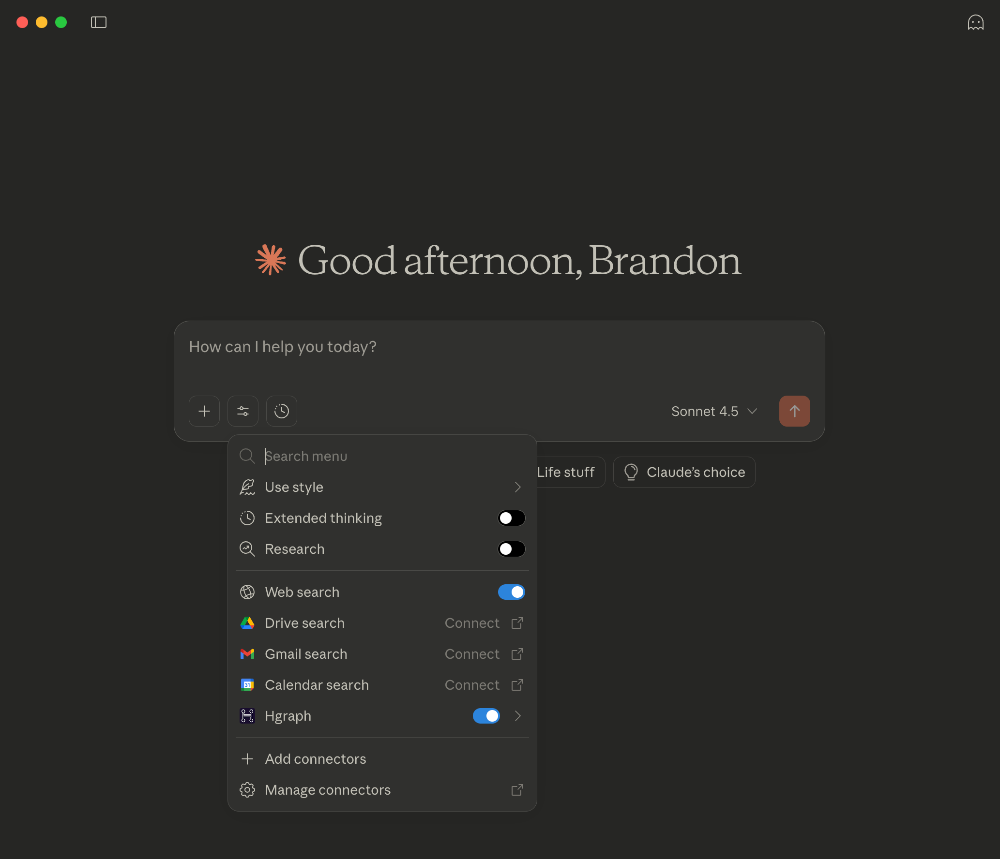
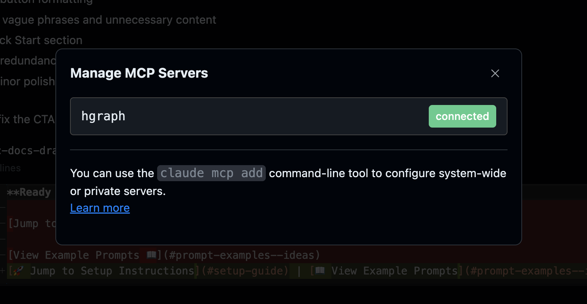

# Claude Setup Guide

Claude offers the smoothest MCP experience with native support and flexible configuration across all Claude platforms.

## Prerequisites

Before setting up the MCP connector, you'll need:

1. **Hgraph API Key** (Free)
   - Create an account at [hgraph.com/hedera](https://hgraph.com/hedera)
   - Get your free API key from the dashboard
   - No credit card required for the free tier

2. **Claude Account**
   - Claude Pro subscription required for custom connectors
   - Available at [claude.ai](https://claude.ai)

## Official Hgraph MCP URL

Use this URL format with your API key:

```text
https://mainnet.hedera.api.hgraph.io/v1/<YOUR-HGRAPH-API-KEY>/mcp
```

Replace `<YOUR-HGRAPH-API-KEY>` with your actual API key from the [Hgraph dashboard](https://dashboard.hgraph.com).

## Set up in Claude Web & Desktop



1. Sign in to [Claude web](https://claude.ai) or open Claude Desktop
2. Click your profile icon (bottom left) and select "Settings"
3. Navigate to the "Connectors" tab in the left sidebar
4. Click "Add custom connector" button
5. In the "Name" field, enter `Hgraph` (case-sensitive)
6. In the "URL" field, paste your complete MCP URL with your API key:

   ```text
   https://mainnet.hedera.api.hgraph.io/v1/<YOUR-HGRAPH-API-KEY>/mcp
   ```

7. Click "Save connector" and you'll see Hgraph in your connectors list

### How to use Hgraph MCP in Claude

1. Start a new chat and ensure the Hgraph connector is switched "on"
2. Write prompts that specify Hedera data queries
3. Claude automatically calls the appropriate Hgraph tools

**Example prompt:** "What is the current total supply of HBAR?"

:::tip Mobile Support
Once configured in Claude web or desktop, the Hgraph MCP will automatically appear in the Claude mobile app when signed into the same account.
:::

## Set Up in Claude Code CLI

Claude Code provides the most powerful MCP experience for developers and technical users.



### Installation Steps

1. Install Claude Code ([installation guide](https://docs.claude.com/en/docs/claude-code/getting-started))
2. Complete any IDE-specific configurations
3. Add the Hgraph MCP connector via terminal:

   ```bash
   claude mcp add --transport http hgraph https://mainnet.hedera.api.hgraph.io/v1/<YOUR-HGRAPH-API-KEY>/mcp
   ```

4. Restart Claude Code:
   - **VS Code**: Reload window (Cmd/Ctrl+R)
   - **Terminal**: Exit and restart your session

5. Verify the connection:

   ```bash
   claude mcp list
   ```

   You should see `hgraph` in the list of connected MCPs

### How to use Hgraph MCP in Claude Code CLI

Simply start a conversation and write prompts that specify Hedera data queries. Claude Code automatically calls the appropriate Hgraph tools.

:::tip Auto-approval Configuration
To avoid approving every Hgraph tool call, configure auto-approval by adding to your allowlist:

```bash
# Add Hgraph tools to auto-approval list
claude config set allowlist "mcp__hgraph__*"
```
:::

## Troubleshooting

### Connector not appearing
- Ensure you have an active Claude Pro subscription
- Refresh the settings page
- Try signing out and back in

### Connection errors
- Verify your API key is correct
- Check that the URL format matches exactly
- Ensure your Hgraph API key is active

### Claude Code issues
- Make sure Claude Code is fully restarted after adding the connector
- Verify the connector appears in `claude mcp list`
- Check that your terminal has internet access

## Next Steps

- [View Examples & Use Cases →](./examples)
- [Learn Usage Tips & Best Practices →](./usage-guide)
- [ChatGPT Setup Guide →](./setup-chatgpt)

---

*Need help? Visit [docs.hgraph.com/support](https://docs.hgraph.com/support) or join our [Discord community](https://discord.gg/dwxpRHHVWX)*