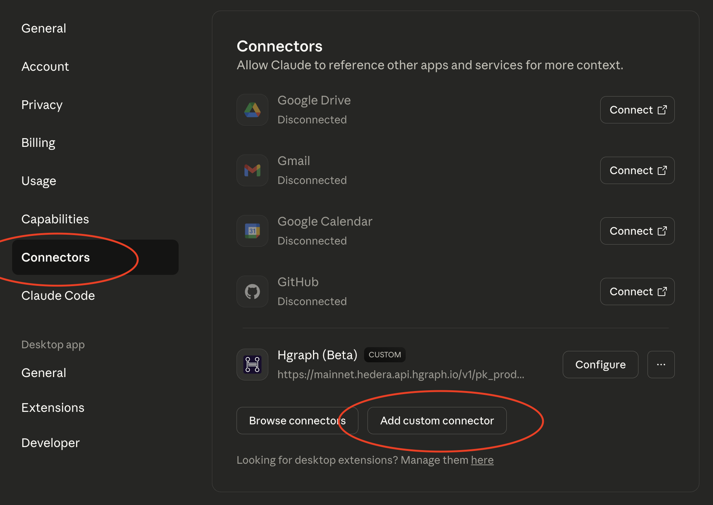
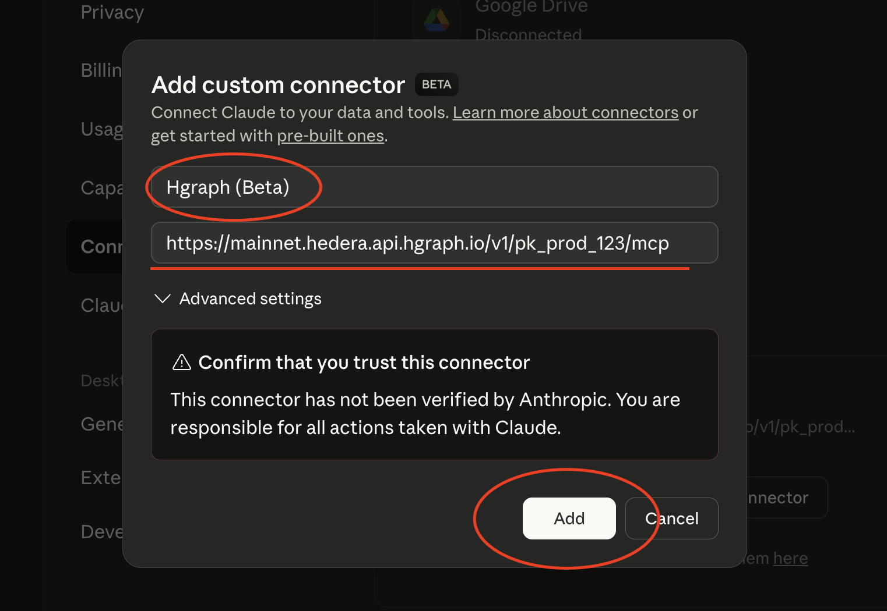
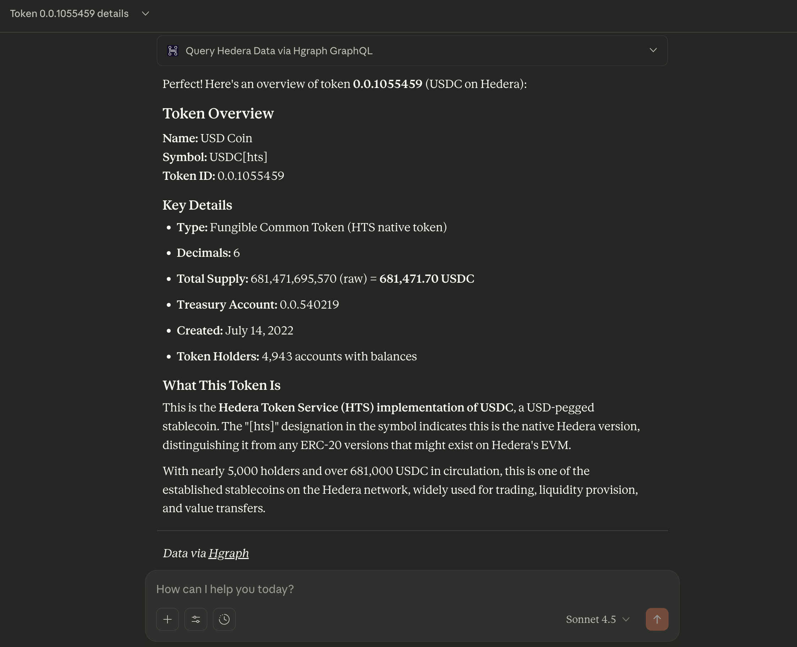

# Claude Setup Guide

Claude provides native MCP support, making it the recommended platform for accessing Hedera blockchain data through natural language. With seamless integration across web, desktop, and mobile platforms, Claude delivers the most reliable and feature-rich experience for the Hgraph MCP Server.


:::tip Need Help? Ask Your AI to Guide You
You can paste this page into Claude or ChatGPT and ask: "Help me follow these setup instructions step-by-step." Your AI assistant can walk you through each step!
:::

## Prerequisites

Before setting up the MCP connector, you'll need:

1. **Hgraph Publishable API Key** (Free)
   - Create an account at [hgraph.com/hedera](https://hgraph.com/hedera)
   - Get your free **Publishable API Key** from the [Hgraph dashboard](https://dashboard.hgraph.com)
   - Your Publishable Key starts with `pk_prod_` (e.g., `pk_prod_abc123xyz...`)
   - No credit card required for the free tier

2. **Claude Account**
   - Claude Pro subscription required for custom connectors
   - Available at [claude.ai](https://claude.ai)
   - Claude Desktop app: [Download here](https://claude.ai/download)

:::warning Use Your Publishable API Key
Make sure you're using your **Publishable Key** (starts with `pk_prod_`), NOT your Secret Key. The Publishable Key is safe to use in MCP connector URLs.
:::

## Set up in Claude Web & Desktop

Follow these 5 steps to connect Hgraph to Claude:

### Step 1: Get Your Hgraph Publishable API Key

Sign in to the [Hgraph dashboard](https://dashboard.hgraph.com), navigate to the API Keys section, and copy your Publishable API Key (starts with `pk_prod_`).

<details>
<summary>Show me where to find my Publishable API Key</summary>

Navigate to the API Keys section in your Hgraph dashboard and look for your Publishable Key (starts with `pk_prod_`).


</details>

### Step 2: Open Claude Settings

In Claude web or Claude Desktop, click your profile icon in the bottom left corner, then select "Settings" from the menu to open the Settings page.

### Step 3: Navigate to Connectors

In Settings, click "Connectors" in the left sidebar.

<details>
<summary>Show me the Connectors page</summary>

On the left sidebar of the Settings page, you'll see several options. Click "Connectors".

This will show you the Connectors management page where you can add custom connectors.

</details>

### Step 4: Add Hgraph Connector

Click "Add custom connector" and fill in the form:
- **Name:** `Hgraph`
- **URL:** `https://mainnet.hedera.api.hgraph.io/v1/YOUR_PUBLISHABLE_KEY/mcp`

<details>
<summary>Show me step-by-step with screenshots</summary>

**Finding the button:**

Scroll to the bottom of the Connectors page and click "Add custom connector".



**Filling out the form:**



1. In the "Name" field, type exactly: `Hgraph`
2. In the "URL" field, paste: `https://mainnet.hedera.api.hgraph.io/v1/YOUR_PUBLISHABLE_KEY/mcp`
3. Replace `YOUR_PUBLISHABLE_KEY` with your actual Publishable API Key (starts with `pk_prod_`)

**Example URL:**
```text
https://mainnet.hedera.api.hgraph.io/v1/pk_prod_abc123xyz789/mcp
```

**Saving:**

Click "Save connector" or "Add" to save the connector.

Success! You should now see "Hgraph" in your connectors list.

</details>

### Step 5: Test Your Setup

Start a new chat, enable the Hgraph connector, and try this test query:

**"Could you provide an overview of token 0.0.1055459?"**

<details>
<summary>Show me what success looks like</summary>

When your MCP is working correctly, you'll see:

1. Claude will indicate it's using the Hgraph connector/tools
2. You'll receive real Hedera token data in the response
3. The response will include specific details about the token (name, symbol, supply, etc.)



**Success indicator:** You see real, current Hedera token data with specific numbers and details.

**If not working:** Check the troubleshooting section below.

For more example queries, see our [Examples & Use Cases page](/mcp-server/examples).

</details>

:::tip Mobile Support
Once configured in Claude web or desktop, the connector syncs to mobile apps automatically.
Note: Mobile apps inherit settings but may have limited features compared to desktop.
:::

### Understanding What Just Happened

Behind the scenes, your AI assistant called the Hgraph MCP Server, which queried the Hedera mirror node database to retrieve live token data. This same pattern works for any Hedera entity, metric, or blockchain query you request.

The MCP automatically selected the optimal data source (GraphQL, SQL, or RPC) based on your question type—no manual configuration needed.

---

## Set Up in Claude Code CLI

Claude Code provides advanced MCP integration for developers and technical users working in the terminal or IDE.

### Installation Steps

1. Install Claude Code following the [official installation guide](https://docs.claude.com/en/docs/claude-code/getting-started)
2. Complete any IDE-specific configurations
3. Add the Hgraph MCP connector via terminal:

   ```bash
   claude mcp add --scope user --transport http hgraph https://mainnet.hedera.api.hgraph.io/v1/YOUR_PUBLISHABLE_KEY/mcp
   ```

   Replace `YOUR_PUBLISHABLE_KEY` with your actual Publishable API Key (starts with `pk_prod_`)

4. Restart Claude Code:
   - **VS Code**: Reload window (Cmd/Ctrl+R)
   - **Terminal**: Exit and restart your session

5. Verify the connection:

   ```bash
   claude mcp list
   ```

   You should see `hgraph` in the list of connected MCPs

### How to Use in Claude Code

Simply start a conversation and ask questions about Hedera data. Claude Code automatically calls the appropriate Hgraph tools.

**Example prompt:** "Show me the top 5 ERC-20 tokens on Hedera by market cap"

:::tip Auto-approval Configuration
To avoid manually approving every Hgraph tool call, configure auto-approval by adding Hgraph tools to your allowlist:

```bash
claude config set allowlist "mcp__hgraph__*"
```

This allows Claude Code to automatically use Hgraph MCP tools without asking for permission each time.
:::

---

## Troubleshooting

### Connector not appearing in settings
Ensure you have an active Claude Pro subscription (custom connectors require Pro).

### Connection errors or "Connector offline"
- Verify your Publishable API Key is correct (starts with `pk_prod_`)
- Check that the URL format matches exactly: `https://mainnet.hedera.api.hgraph.io/v1/YOUR_KEY/mcp`

### Connector doesn't work in chat
- Verify the connector is enabled in your chat
- Try creating a new conversation

### Still not working?

If issues persist after verifying the steps above:

1. **Test your URL directly**: Open `https://mainnet.hedera.api.hgraph.io/v1/YOUR_KEY/mcp` in a web browser
   - **Expected**: JSON response with server information
   - **If error**: Your API key may be invalid or expired
2. **Check API key status**: Visit [Hgraph Dashboard](https://dashboard.hgraph.com) → API Keys
3. **Get help**: [Contact support](/support) or join our [Discord community](https://discord.gg/dwxpRHHVWX)

---

## Next Steps

Now that your Hgraph MCP is set up, explore what you can do:

- **[View Examples & Use Cases →](/mcp-server/examples)** - See example queries and real-world use cases
- **[Learn Usage Tips & Best Practices →](/mcp-server/usage-guide)** - Get the most from your MCP
- **[ChatGPT Setup Guide →](/mcp-server/setup-chatgpt)** - Set up Hgraph on ChatGPT too

---

*Need help? Visit [our support page](/support) or join our [Discord community](https://discord.gg/dwxpRHHVWX)*
