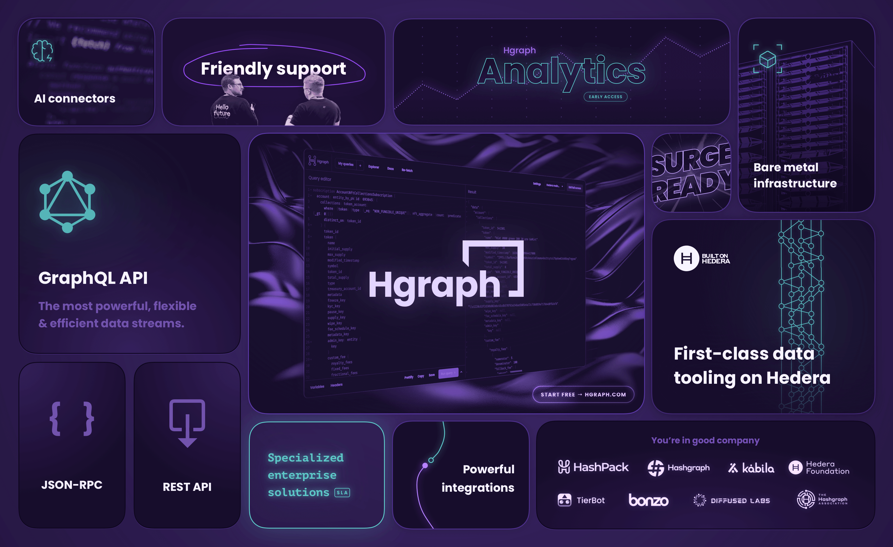

# About Hgraph

Hgraph is a company focused on custom startup and enterprise solutions as well as APIs and infrastructure for the Hedera ecosystem and beyond. Our core offerings include Hedera mirror node APIs (GraphQL, JSON-RPC relay & REST), bare metal infrastructure, SDKs, and bespoke software engineering services.

Learn more about Hgraph on our [official website](https://hgraph.com).

## Mission & vision

The mission for Hgraph is simple: to make data access on the Hedera network (and beyond) as easy, flexible, and affordable as possible. This is achieved by focusing on the unique needs of customers and sharing those innovations with the broader ecosystem. This illustration showcases that vision:

## What’s next for Hgraph?

After years serving the Hedera community and developing robust node infrastructure, Hgraph is well positioned for a new phase of discovery and innovation. We’re focused on AI, infrastructure management, blockchain and tooling for web3 ecosystems.

[**Work with us →**](contact)

:::note Looking for logos?
Here you'll find all of [Hgraph's branding assets](/resources/brand).
::: 