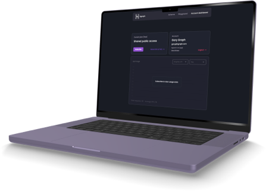
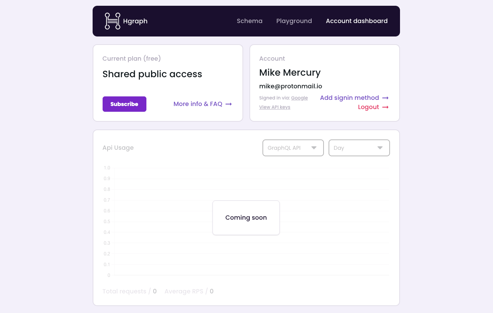
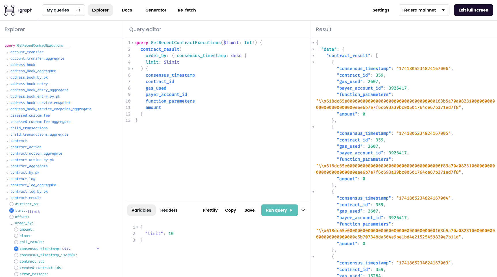

# Hgraph Account Dashboard

:::info Account Dashboard & Playground are in Beta

Our new account dashboard is **best viewed on desktop**. We will add mobile support soon. **Feedback is appreciated**, please [reach out here](/overview/contact) with your thoughts and questions!

:::

## Overview

The **[Hgraph Account Dashboard](https://dashboard.hgraph.com)** provides an intuitive interface for developers, startups, enterprises, and beginners to access Hedera data via Hgraph APIs ([GraphQL](/category/graphql-api), [REST](/category/rest-api), and [JSON-RPC](/category/json-rpc)). 

- Start for free and upgrade anytime. Plans begin at $18/month.
- All plans include support, API access, and additional tools.
- Enterprise and startup solutions available with custom limits, dedicated support, SQL access, and enterprise SLAs.
- Quick sign-up in 10 seconds using email, Hedera wallet, GitHub, or Google.

### [Get your free API key →](https://dashboard.hgraph.com)

Also, [learn more about our plans](https://hgraph.com/hedera) and [services for enterprise & startups](https://hgraph.com/enterprise).

---

## Features

The Hgraph Dashboard includes the following capabilities:

- Subscription management via Stripe
- Easy and simple API key access
- Wallet login (supports HashPack, Kabila, Blade, and more)
- Sign in with email, Google, or GitHub
- Powerful GraphQL developer playground
- Fullscreen editor and schema explorer mode
- Light mode & dark mode
- [Hgraph AI Assistant](/graphql-assistant) for building queries
- Mirror node schema explorer
- 45k requests per month for free
- *More features coming soon ([get notified](https://hgraph.beehiiv.com/subscribe))*

---

## Why Did We Build the Dashboard?

Our team at **[Hgraph](https://hgraph.com)** has supported the Hedera ecosystem for years, working with major organizations and projects of every size. Over time, we recognized a growing need for accessible, high-speed API services.

The demand for real-time Hedera data is increasing. Both businesses and developers need blazing fast, easy and reliable access.

- **Simplifying the onboarding process:** Beginners often find working with APIs complex and time-consuming. The dashboard makes it fast and easy to get started.
- **Empowering developers:** Builders can create data-rich applications more efficiently.
- **Cost-saving for projects:** Businesses and startups benefit from cost-effective API access with customizable plans.
- **Enterprise-ready:** Hgraph is now both a fully enterprise-grade infrastructure provider and a retail ready resource!

Ultimately, we try our very best to build the things our customers and partners want most. We hope you enjoy the new account dashboard, [feedback is always welcome!](/overview/contact)

---

## Getting Started

Our Account Dashboard allows you to easily create and manage your account plus access our query playground and schema explorer. This is what our account dashboard looks like:

### Create an Account

1. Go to the **[Hgraph Dashboard](https://dashboard.hgraph.com)**.
2. Sign up in just 10 seconds.
3. Start querying data!

**Upgrade anytime:** plans start at $18/month, with custom API limits, consulting, and hosting solutions available. 

**[Learn more](https://hgraph.com/hedera)** about our subscription plans.

### Upgrade Your Plan

1. Click the `Subscribe` button.
2. Choose a subscription plan.
3. Enter your details and pay via Stripe.

### Access Your API Key

1. Click `View API Keys` under your profile.
2. Reveal the keys and copy your API key.

### Add a Sign-in Method

1. Click `Add signin method` under your profile.
2. Connect an additional sign-in method.

### Explore the Mirror Node Schema

1. Click `Schema` in the top navigation.
2. Browse using the visual schema explorer.

### Switch Between Light & Dark Mode

1. Click `Settings` in the Playground menu.
2. Under `Theme`, select your preferred mode.

---

## GraphQL Playground

The GraphQL Playground is an interactive tool that allows users to build, test, and run queries. It works very well with our [Hgraph AI Assistant](/graphql-assistant). This is what our GraphQL query playground looks like:

### How to Access the Query Playground

1. Log in to the Hgraph Dashboard.
2. Click `Playground` in the top navigation.
3. Start composing queries.

### How to Compose & Run a Query

1. Click `Explorer` in the Playground menu.
2. Find the entity you want to query.
3. Build your query using available fields.
4. Click `Run query`.
5. View your queried data instantly.

### Start a New Query

- Click `New Query` at the bottom left of the Playground.

### Save Queries

1. Click `My Queries` in the Playground menu.
2. View your saved queries.
3. Save a query by:
   - Clicking the `+` button.
   - Clicking `Save` at the bottom of the query editor.

### Copy a Query to Clipboard

- Click `Copy` at the bottom of the query editor.

### Add Headers & Variables

1. In the Playground, click `Headers` or `Variables`.
2. Input the necessary headers or variables.

### Format Your GraphQL Query

- Click `Prettify` at the bottom of the query editor.

### Change Networks

1. Click `Hedera Mainnet` in the top-right of the Playground menu.
2. Select a network.
3. Click `Re-fetch` to reload data.

---

## Troubleshooting Errors

**If you encounter issues, follow these steps:**

1. Ensure you are signed in correctly.
2. Review any query errors.
3. Verify your query variables & headers.
4. Check if you are using the correct network.
5. Click `Re-fetch` in the Playground menu.
6. Refresh the page—if issues persist:
   - Log out and back in.
   - Clear local storage.

The **[Hgraph AI Assistant](/graphql-assistant)** can resolve 90% of issues instantly.

### Clear Local Storage

1. Click `Settings` in the Playground menu.
2. Click `Clear Data` under `Clear Storage`.

### Contact & Support

For support, open a ticket via:

- [Hgraph Discord](https://discord.gg/dwxpRHHVWX)
- Email: support@hgraph.com

We respond to paid customer requests within 48 hours. If you require enterprise support, please include details in your request.
