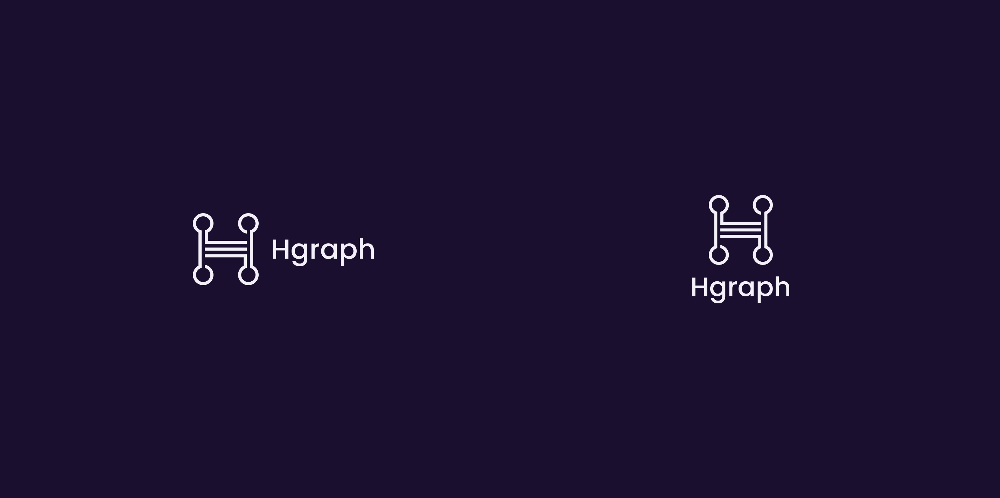
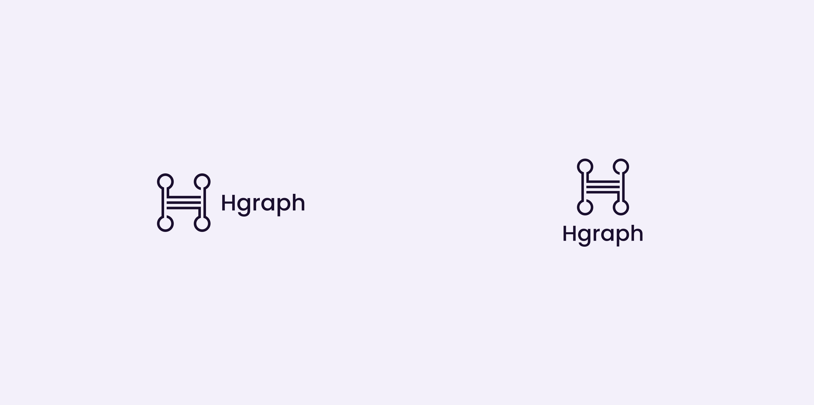
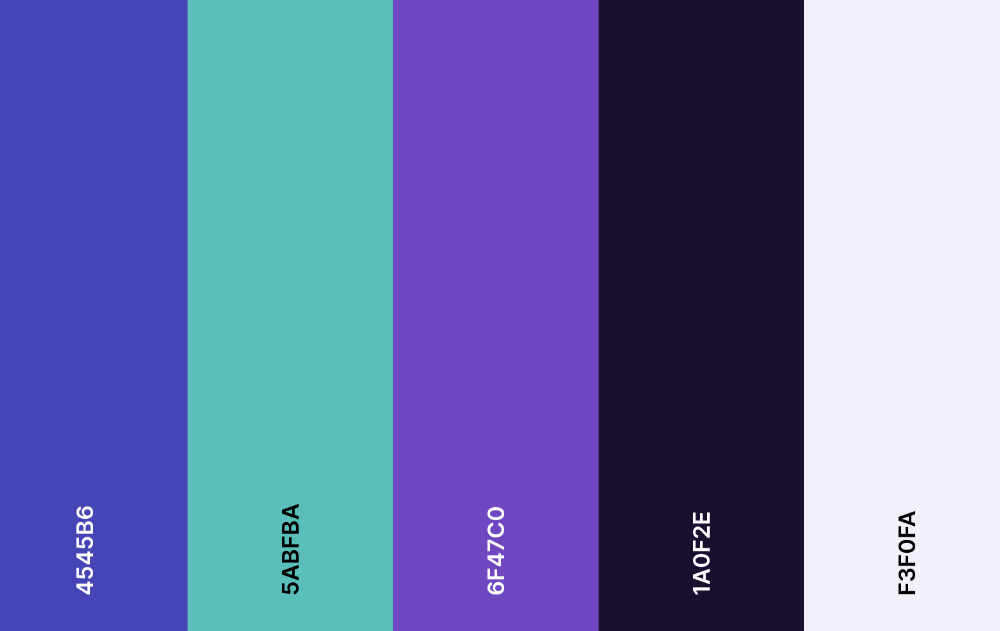

# Brand Assets

Here, you'll find various formats of the Hgraph logo, fonts, colors and other brand assets. This page will be kept up to date as our brand evolves. If you require more information, [please contact our team](/overview/contact).

## Hgraph Logos

Our logo comes in various formats, arrangements and colors. The files are available for download via the Google Drive links below.

### Download logos

* **Horizontal:** [PNG](https://drive.google.com/drive/folders/144d2jfktm0QCNxDVVjxj4axeiOB5LLK4?usp=drive_link) / [SVG](https://drive.google.com/drive/folders/13gAPNjuKOTzVYQ9TC5kEAVa9g9WLg5Ds?usp=drive_link)
* **Vertical:** [PNG](https://drive.google.com/drive/folders/141mPJ9MPpkrHesGSA9WP9Av9a2eOvoUd?usp=drive_link) / [SVG](https://drive.google.com/drive/folders/13kpHjIHcHoIEcbiP6I-AglV0VONz8esU?usp=drive_link)
* **Logomark only:** [PNG](https://drive.google.com/drive/folders/146B_YTITzrevBEEPEBDPD_kMIsXqQ_GL?usp=drive_link) / [SVG](https://drive.google.com/drive/folders/13j4jUQnKKp4wHbkD-ZGyaKmSvCEH6Ci_?usp=drive_link)
* **[Download all (.zip) ↓](Hgraph-Brand-Logos.zip)**

## Color Palette

### [Interactive color palette →](https://coolors.co/4545b6-5abfba-6f47c0-1a0f2e-f3f0fa)

### Brand colors
* **Purple** (primary): `#6F47C0`
* **Blue** (secondary): `#4545B6`
* **Teal** (accent): `#5ABFBA`
* **Dark**: `#1A0F2E`
* **Light**: `#F3F0FA`

## Font

Hgraph uses the **[Poppins](https://fonts.google.com/specimen/Poppins)** font across all materials and properties.