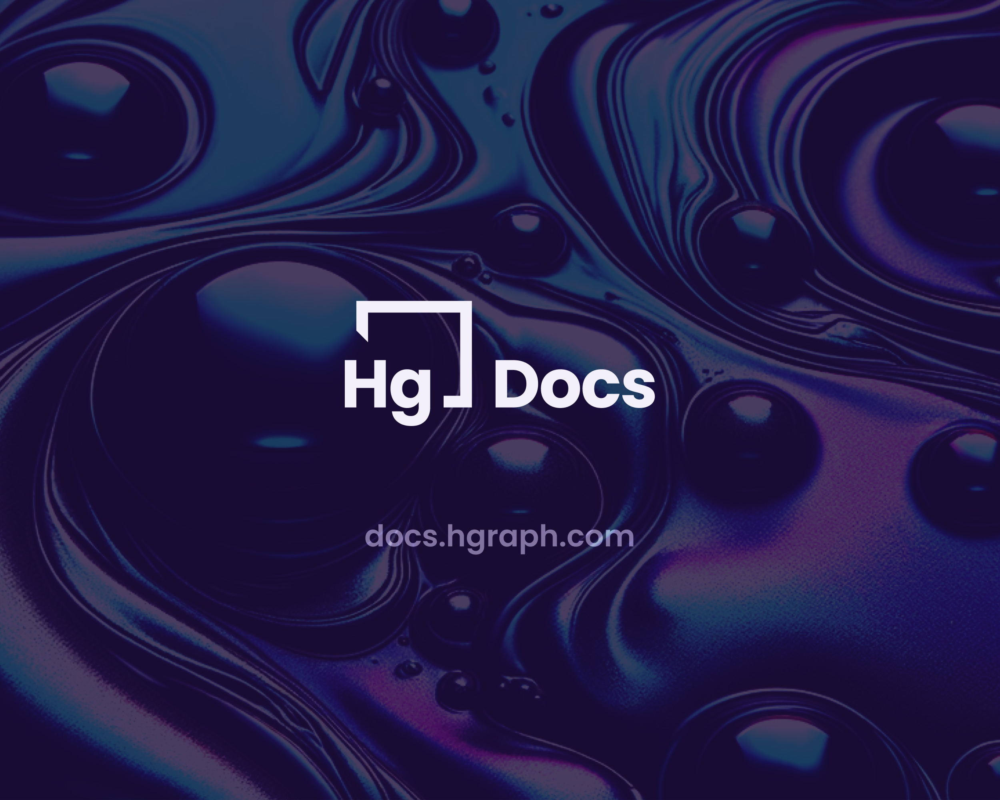

# Welcome

Welcome to the official documentation for **[Hgraph](https://hgraph.com)**, an infrastructure, data services and software engineering company focused on AI, blockchain and more. Core offerings include Hedera APIs ([GraphQL](/category/graphql-api), [REST](/category/rest-api), and [JSON-RPC](/category/json-rpc), custom node infrastructure, SDKs, and bespoke software engineering services.

The purpose of this documentation is to help developers fully leverage the capabilities of Hgraph's data tooling and APIs, and to help first-time users easily get started.

:::info Hgraph AI Data Agent (Beta)

Explore Hedera data with natural language—no coding required.
Powered by the Hgraph MCP Server. **[Try it free →](https://hgraph.ai)**

:::

## Quick links

- **[Dashboard](https://dashboard.hgraph.com)** - Sign up and manage your account.
- **[AI Data Agent](https://hgraph.ai)** - Explore Hedera data with natural language.
- **[Pricing](/overview/pricing)** - Start for free, upgrade later (starting at $18/mo).
- [GraphQL API](/category/graphql-api) - Access data on the Hedera mirror nodes.
- [ERC Token Data](/category/erc-token-data) - Access pure ERC-20 and ERC-721 token data on Hedera.
- [Hgraph SDK](/category/hgraph-sdk) - Build data-rich apps and experiences.
- [GitHub](https://github.com/hgraph-io) - Follow Hgraph on GitHub and contribute.
- [Support](/support) - Get assistance from our team & community.
- [Contact & follow](/overview/contact) - Reach out and stay in touch!

### [Create an Hgraph account 🚀](https://dashboard.hgraph.com)